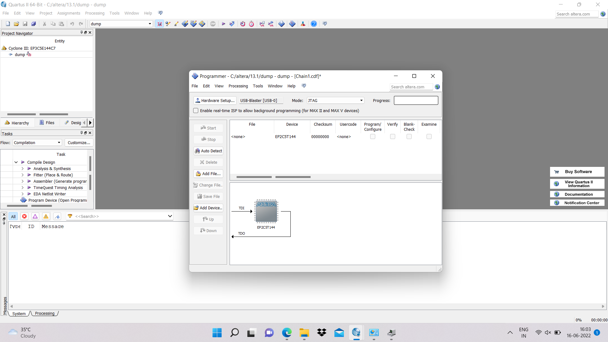

# Experiment 11 Programming logic devices FPGA BOARDS

## AIM:

To understand the standard procedure to interface an FPGA board and flashing method using usb blaster.

## HARDWARE REQUIRED:

PC, Cyclone II , USB flasher

## SOFTWARE REQUIRED: 

Quartus prime

## THEORY:-

## PROCEDURE:

### STEP 1:
Start the Quartus II Programmer.
### STEP 2:
Click Add File and select the path to the desired software.
### STEP 3:
Turn on the Program/Configure option for the added file.
### STEP 4:
Click Start to download the selected file to the FPGA. Configuration is complete when the progress bar reaches 100%.

## OUTPUT:

## RESULT:

